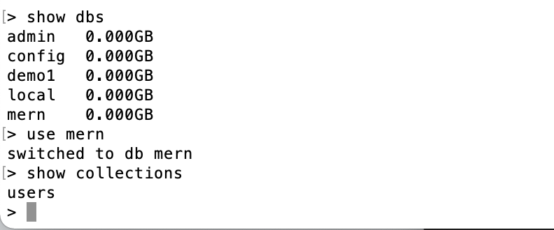

## mongodb使用

### 配置

修改mongodb配置文件，配置文件默认在 /usr/local/etc 下的 mongod.conf

```shell
vi /usr/local/etc/mongod.conf

systemLog:
  destination: file
  path: /usr/local/var/log/mongodb/mongo.log //修改日志输出存储路径
  logAppend: true
storage:
  dbPath: /data/db //修改数据库存储路径

```

### 启动服务

``` shell
# 启动服务
mongod
# 启动服务，并且指定数据文件存放路径
mongod --dbpath /Users/admin/mongodb/data/demo1

```

连接db

`mongo // 默认host:localhost 端口:27017`

### 常用命令

```shell
# 查看数据库列表
show dbs

# 选择或创建数据库（不存在则创建）
use dbname

# 删除数据库
db.dropDatabase()

# 查看数据库中的集合列表
show collections

# 创建集合
db.createCollection('demo')

# 删除集合
db.collectionname.drop()

# 向数据库的集合中添加数据
db.collectionname.insert()

#  查找集合中的数据
db.collectionname.find()

# 限制查找数据的数量，可以使用limit函数
db.collectionname.find().limit(num)

# 跳过指定的数据，可以使用skip函数
db.collectionname.find().skip(num)

# 获得查找的数据的长度，可以使用count函数
db.collectionname.find().count()

# 查找集合中的一个数据
db.collectionname.findOne()

# 删除集合中的数据
db.collectionname.remove()

# 删除name=value的第1条数据
db.collectionname.remove({name:'value'},1)

# 更新name=value的第1个数据为update-value
db.collectionname.update({name:'value'},{$set:{name:'update-value'}})

# 更新所有name=value的数据为update-value
db.collectionname.update({name:'value'}, {$set:{name:'update-value'}}, {multi:true})

```



## mongoose使用

### 创建连接

```javascript
const mongoose=require('mongoose');

const defaultOpts=require('./dataOpts');

const connectDB=(MONGO_URL,dataOpts=defaultOpts)=>{
  const createDB=mongoose.createConnection(MONGO_URL,dataOpts);
  createDB.on('error',err=>{
    console.log(`数据库[${MONGO_URL}]连接失败！`.red);
  });
  createDB.once('open',res=>{
    console.log(`数据库[${MONGO_URL}]连接成功！`.green);
  });
  return createDB;
};

module.exports=connectDB;

```

### schema

schema类型：

1. String 字符串
2. Number 数字
3. Date 日期
4. Buffer 二进制
5. Boolean 布尔值
6. Mixed 混合类型
7. ObjectId 对象ID
8. Array 数组

```javascript
const schemas={
  name: { type: String, required: true, unique: true, index: true, trim: true },
  email: { type: String, required: true },
  password: { type: String },
  age: { type: Number },
  sex: { type: String },
};
const dataSchema=new mongoose.Schema(schemas);

```
通用属性：

- required: 布尔值或函数 如果值为真，为此属性添加 required 验证器
- default: 任何值或函数 设置此路径默认值。如果是函数，函数返回值为默认值
- select: 布尔值 指定 query 的默认 projections
- validate: 函数 adds a validator function for this property
- get: 函数 使用 Object.defineProperty() 定义自定义 getter
- set: 函数 使用 Object.defineProperty() 定义自定义 setter
- alias: 字符串 仅mongoose >= 4.10.0。 为该字段路径定义虚拟值 gets/sets
- index: 布尔值 是否对这个属性创建索引
- unique: 布尔值 是否对这个属性创建唯一索引
- sparse: 布尔值 是否对这个属性创建稀疏索引

String

- lowercase: 布尔值 是否在保存前对此值调用 .toLowerCase()
- uppercase: 布尔值 是否在保存前对此值调用 .toUpperCase()
- trim: 布尔值 是否在保存前对此值调用 .trim()
- match: 正则表达式 创建验证器检查这个值是否匹配给定正则表达式
- enum: 数组 创建验证器检查这个值是否包含于给定数组

Number

- min: 数值 创建验证器检查属性是否大于或等于该值
- max: 数值 创建验证器检查属性是否小于或等于该值

Date

- min: Date
- max: Date

### models

```javascript
const listUser=(db,req,res)=>{
  db.find((error,result)=>{
    if(error){
      return res.status(res.statusCode).send({error});
    }
    return res.status(200).send({result});
  });
};
const addUser=(db,req,res)=>{
  const {body}=req;
  const user=new db(body);
  user.save((error,result)=>{
    if(error){
      return res.status(500).send({error});
    }
    return res.status(200).send({message:'添加成功！'});
  });
};
const editUser=(db,req,res)=>{
  const {body}=req;
  db.updateOne({_id:body._id},{$set:body},error=>{
    if(error){
      return res.status(500).send({error});
    }
    return res.status(res.statusCode).send({message:'更新成功！'});
  });
};
const deleteUser=(db,req,res)=>{
  const {body}=req;
  db.deleteOne({
    _id:body.ids[0],
  },error=>{
    if(error){
      return res.status(500).send({error});
    }
    return res.status(res.statusCode).send({message:'删除成功！'});
  });
};

```

### 中间件

中间件 (pre 和 post 钩子) 是在异步函数执行时函数传入的控制函数。

```javascript
const preSave=function (next){
  if(!this.isModified('password')){
    return next();
  }
  this.password=shaPwd(this.password);
  next();
};

const dataSchema=new mongoose.Schema(schemas);
dataSchema.pre('save',preSave);

```

鉴权中间件

```javascript
const ensureAuthenticated=(req,res,next)=>{
  if(!req.header('Authorization')){
    return res.status(401).send({message:'用户未登录，请登录后操作!'});
  }
  const token=req.header('Authorization').split(' ')[1];
  let payload=null;
  try{
    payload=jwtDecode(token);
  }catch(err){
    return res.status(401).send({message:err.message});
  }
  if(!payload.active){
    return res.status(401).send({message:'验证信息错误，请重新登录!'});
  }
  if(payload.exp<=moment().unix()){
    return res.status(401).send({message:'验证信息过期，请重新登录!'});
  }
  req.user=payload.sub;
  next();
};

```

### 启动服务

引用API配置文件（前端也是引用这里的配置，只需维护一份API即可）。

```javascript
const db=require('./createDb');
const dbm=require('./dbm');
const {target}=require('../../../configs/apis/configs');

const startDb=(app,apis)=>{
  Object.keys(apis).map(v=>{
    const {url,method='get'}=apis[v];
    app[method](`${target}${url}`,(req,res)=>{
      dbm[v](db,req,res);
    });
  });
};

```


